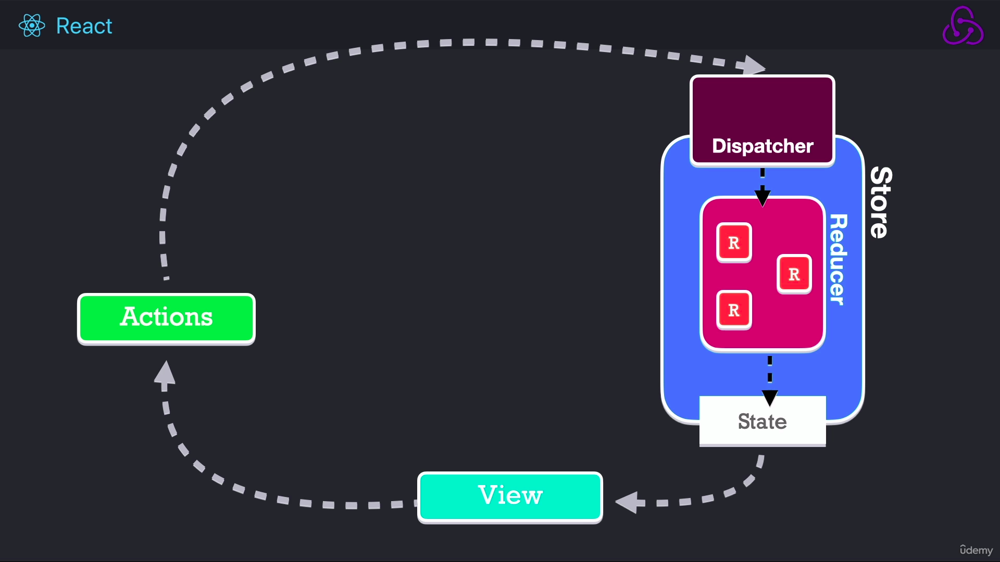
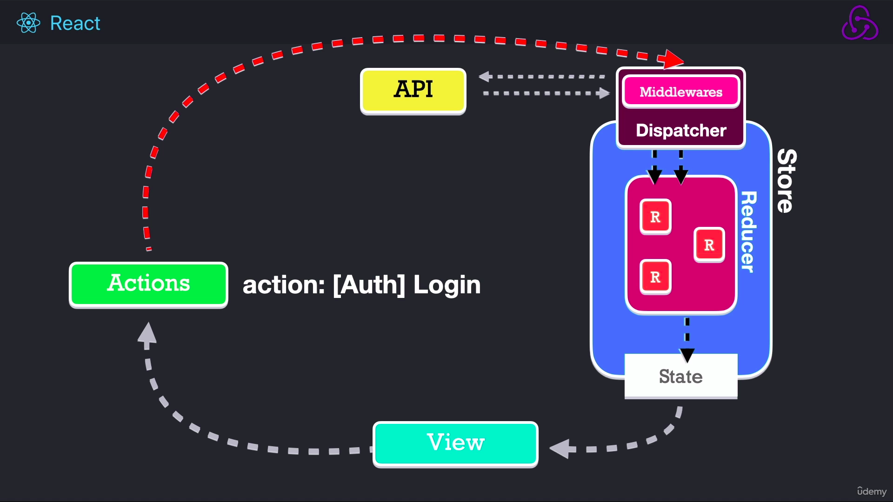

# QUÉ ES REDUX?

- Es un contenedor predecible del estado de nuestra aplicación.

## Store (fuente única de la verdad)

- Ahí es donde está la información que mis componentes consumirán.

## Proceso redux SINCRONO



# Proceso redux Asíncrono



## Instalación

```bash
yarn add @reduxjs/toolkit react-redux
```

## 1. ConfigureStore y Slices

- como dice su nombre, lo primero que debemos de realizar es configurar nuestra store. Es el lugar donde tendremos nuestro estado global.

```js
// store/store.js
const { configureStore } = require("@reduxjs/toolkit");

export const store = configureStore({
  reducer: {},
});
```

## 2. Proveer nuestro store en nuestra app. Se recomienda que esté en la parte más arriba de nuestra aplicación.

```js
// main.jsx
import React from "react";
import ReactDOM from "react-dom/client";
import { Provider } from "react-redux";
import App from "./App";
import "./index.css";
import { store } from "./store";

ReactDOM.createRoot(document.getElementById("root")).render(
  <React.StrictMode>
    <Provider store={store}>
      <App />
    </Provider>
  </React.StrictMode>
);
```

## 3. Crear nuestros Slices

```js
// store/slices/counter/counterSlice.js
import { createSlice } from "@reduxjs/toolkit";

const initialState = {
  value: 10,
};

export const counterSlice = createSlice({
  name: "counter",
  initialState,
  reducers: {
    increment: (state) => {
      // Redux Toolkit allows us to write "mutating" logic in reducers. It
      // doesn't actually mutate the state because it uses the Immer library,
      // which detects changes to a "draft state" and produces a brand new
      // immutable state based off those changes
      state.value += 1;
    },
    decrement: (state) => {
      state.counter -= 1;
    },
    incrementBy: (state, action) => {
      state.counter += action.payload;
    },
  },
});

// Action creators are generated for each case reducer function
export const { increment } = counterSlice.actions;
```

- Un slice no es más que una funciń que tiene guardado el name, un initialState y los reducers.
- Las acciones son creadas por cada caso de la función del reducer.

## 4. useSelector & useDispatch

```js
// App.jsx
import { useDispatch, useSelector } from "react-redux";
import { increment, decrement, incrementBy } from "./store/slices/counter";

function App() {
  const { counter } = useSelector((state) => state.counter);
  const dispatch = useDispatch();

  return (
    <div className="App">
      <h1>Counter: {counter}</h1>
      <hr />
      <button className="btn btn-primary" onClick={() => dispatch(increment())}>
        +1
      </button>
      <button className="btn btn-primary" onClick={() => dispatch(decrement())}>
        -1
      </button>
      <button
        className="btn btn-primary"
        onClick={() => dispatch(incrementBy(4))}
      >
        +x
      </button>
    </div>
  );
}
```

## 5. THUNK

- Un thunk es una función asíncrona que dispara otra acción cuando se resuelve la fc. asíncrona.
- Se trabaja de esta manera cuando tenemos peticiones asincronas.

```js
//! thunks.js
import axios from "axios";
import { pokemonApi } from "../../../api/pokemonApi";
import { setPokemons, startLoadingPokemons } from "./pokemonSlice";

export const getPokemonsThunk = (page = 0) => {
  return async (dispatch, getState) => {
    dispatch(startLoadingPokemons());

    //! petición http

    const { data } = await pokemonApi.get(
      `/pokemon?limit=10&offset=${page * 10}`
    );
    dispatch(setPokemons({ pokemons: data.results, page: page + 1 }));
  };
};
```
